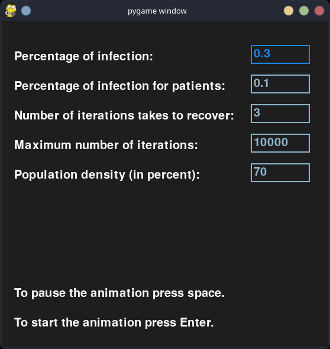
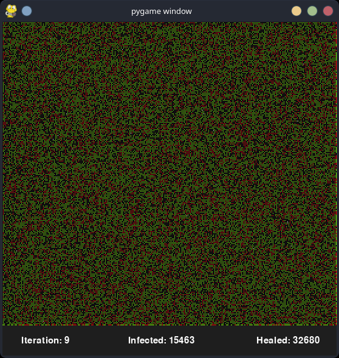

# diseaseSpreadModel
This program is a GUI simulator for a disease spread using a genetic algorithm.

## About
I build an program that simulate a disease spread in the population.

## Installing
- python and install the requirements.txt file.

## View:
The GUI looks like:

The GUI is built with Python using library pygame.
The view includes:
* opening screen where you can choose the parameters for the simulation.
* the view of the spread of the disease in the population with a footer that indicate the iteration number, number of infected and healed.

## Run:
* pip install -r requirements.txt
* python main.py

## Links:
My GitHub project https://github.com/GilAvraham2909/diseaseSpreadModel

## Owners:
* Gil Avraham, Git: https://github.com/GilAvraham2909
